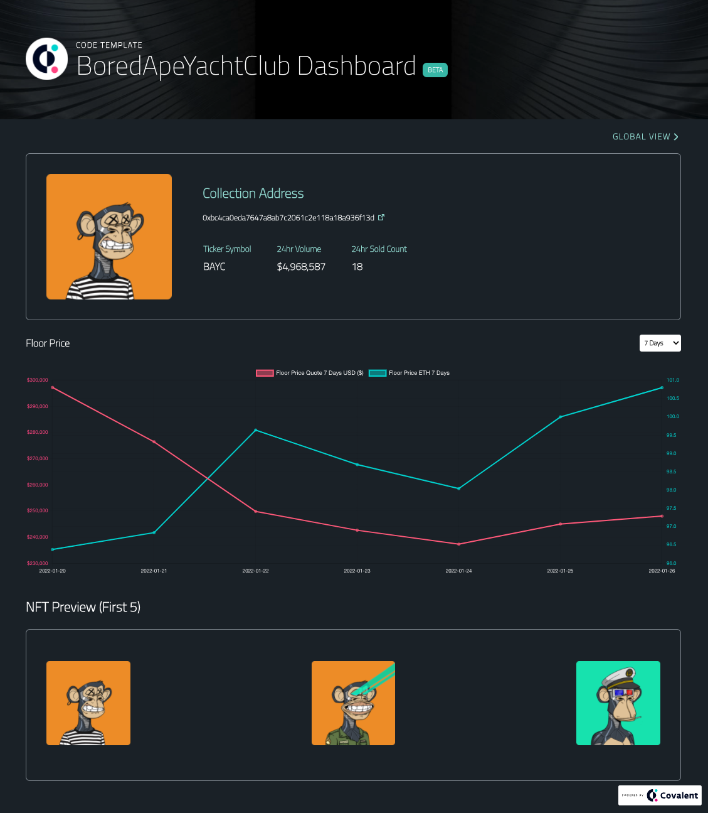
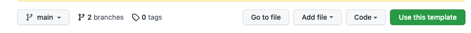
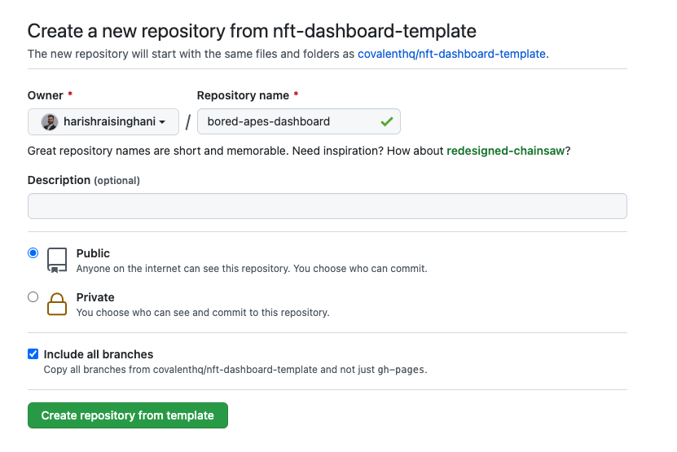
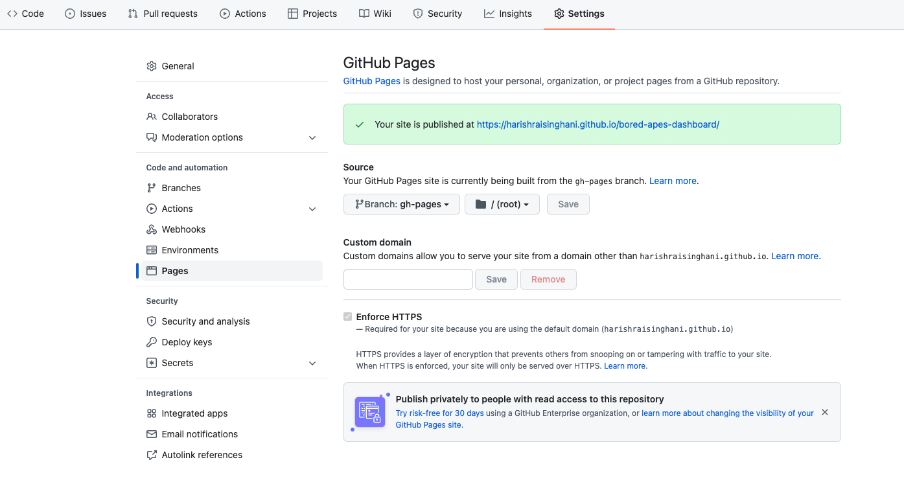
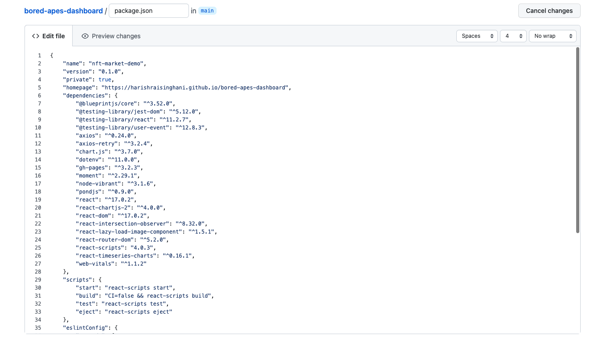
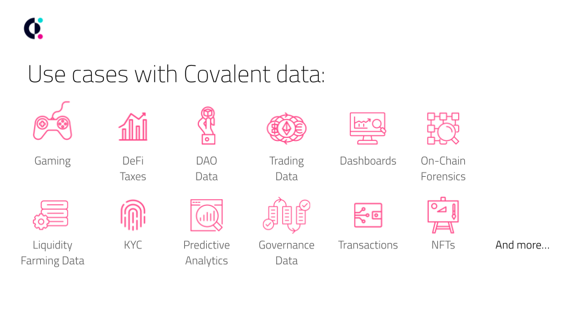

# Create Your Custom NFT Collection Dashboard in Minutes
This code template is designed to get your own customized NFT Collection Dashboard up and running **in just minutes!**.

In the `src/config.js`, simply set your:
- NFT collection contract address
- Blockchain `chain_id` where the contract address is deployed
- Dashboard title and banner

That's it!




## Live Demo
1. [Live on GitHub pages](https://covalenthq.github.io/nft-dashboard-template/)

2. [Live on Replit](https://replit.com/@Covalent-Templates/NFT-Collection-Dashboard-Template?v=1)

The live demo displays:
* A customizable NFT collection dashboard page with a summary, a floor price graph and a preview of the first 5 NFTs in the collection 
* Ability to see where your specific collection ranks in the global view of all NFT collections on a specific blockchain
* Ability to select a specific NFT in your collection and see its metadata

While a default Covalent API Key is used in this code template, it is recommended you register and use your own API key from: https://www.covalenthq.com/platform

&nbsp;
## Fork and Customize

### Local setup
1. `git clone --branch main https://github.com/covalenthq/nft-dashboard-template.git`
2. `cd nft-dashboard-template`
3. `npm install`
4. `npm start`


### GitHub Pages
On GitHub, the code is available at https://github.com/covalenthq/nft-dashboard-template

To get this working with GitHub pages, do the following:

1. Click `Use this template`



2. Name the repo and ensure you check off `Include all branches`. Click `Create repository from template`



3. Under the `Settings` tab, select the `Pages` menu item and copy the URL where your site is published. 



4. Make sure you are on the `main` branch and open up `package.json`. Update the URL next to the `"homepage"` field using the URL where your site is being published. Commit your changes.



5. Make sure you are on the `main` branch and update the code in `src/config.js` using the details for your NFT collection:

```
TEMPLATE: {
    // 1. Set your NFT collection contract address
    "collection_address": "0x9498274b8c82b4a3127d67839f2127f2ae9753f4",

    // 2. Set your blockchain chain ID where your NFT collection contract address is deployed (see below for value options)
    "block_chain_id": "137",

    // 3. Set the default title of your dashboard. If found, this template uses the NFT Collection name automatically for the title.
    "title": "My NFT Collection",

    // 4. (Optional) Boolean for displaying the floor price chart
    "timeseries_chart": true,

    // 5. (Optional) Set your banner image
    "banner_picture": "https://www.superflexfitness.com/wp-content/uploads/2017/03/3D-banner-background.jpg",
  },
```
Commit your changes. Your custom NFT dashboard should be live at your published URL in just a couple minutes. You can check the `Actions` tab in your GitHub repo to confirm that your dashboard has finished deploying. 


### Replit
On Replit, the code and hosted live demo site are integrated in one unified interface. 

To get your customized NFT Dashboard working with Replit, do the following:

1. Go to the [Replit live demo](https://replit.com/@Covalent-Templates/NFT-Collection-Dashboard-Template?v=1) and click `Fork repl`

2. Create a Replit account if you do not already have one. 

3. Update the code in `src/config.js` using the details for your NFT collection (see above for code snippet).

4. Press `Run` and wait for the deployment to complete (it may be a few minutes). Your dashboard will then be live at the provided `...repl.co` URL. 

&nbsp;
## Covalent API Endpoints
The two primary Covalent API endpoints used in this code template include:

1. Detail view of a specific collection:

`/{chain_id}/nft_market_cap/{collection}`

This endpoint allows one to drill down into the details of a collection and the response object looks like the following:
```
{
  "data": {
    "updated_at": "2021-12-19T05:25:26.926980Z",
    "items": [
      {
        chain_id: 1,
        collection_name: "BoredApeYachtClub",
        collection_address: "0xbc4ca0eda7647a8ab7c2061c2e118a18a936f13d",
        collection_ticker_symbol: "BAYC",
        opening_date: "2022-03-14",
        volume_wei_day: "1217540000000000000000",
        volume_quote_day: null,
        average_volume_wei_day: "101461666666667000000",
        average_volume_quote_day: null,
        unique_token_ids_sold_count_day: 9,
        floor_price_wei_7d: "88503461842105200000",
        floor_price_quote_7d: null,
        gas_quote_rate_day: null,
        quote_currency: "USD",
        first_nft_image_token_id: "0",
        first_nft_image: "https://ipfs.io/ipfs/QmRRPWG96cmgTn2qSzjwr2qvfNEuhunv6FNeMFGa9bx6mQ",
        first_nft_image_256: "https://image-proxy.svc.prod.covalenthq.com/256,fit,png/https://ipfs.io/ipfs/QmRRPWG96cmgTn2qSzjwr2qvfNEuhunv6FNeMFGa9bx6mQ",
        first_nft_image_512: "https://image-proxy.svc.prod.covalenthq.com/512,fit,png/https://ipfs.io/ipfs/QmRRPWG96cmgTn2qSzjwr2qvfNEuhunv6FNeMFGa9bx6mQ",
        first_nft_image_1024: "https://image-proxy.svc.prod.covalenthq.com/1024,fit,png/https://ipfs.io/ipfs/QmRRPWG96cmgTn2qSzjwr2qvfNEuhunv6FNeMFGa9bx6mQ",
        second_nft_image_token_id: "1",
        second_nft_image: "https://ipfs.io/ipfs/QmPbxeGcXhYQQNgsC6a36dDyYUcHgMLnGKnF8pVFmGsvqi",
        ...
      },
```
Data for the detail view is at a day granularity. 


2. Global view of Market Cap per blockchain:

`/{chain_id}/nft_market_cap`

This endpoint provides a global view of multiple NFT collections from various marketplaces (from multiple chains) in a table that ranks them on their market cap.

The response object looks similar to the following:
```
{
  "data": {
    "updated_at": "2021-12-19T01:19:05Z",
    "items": [
      {
        "chain_id": 1,
        "collection_name": "Art Blocks",
        "collection_address": "0xa7d8d9ef8d8ce8992df33d8b8cf4aebabd5bd270",
        "volume_eth_24h": "200068300000000000000",
        "volume_quote_24h": 798097.3,
        "avg_volume_eth_24h": "1064193085106380000",
        "avg_volume_quote_24h": 4245.198,
        "contract_deployment_at": null,
        "market_cap_eth": "207008137260122000000000",
        "market_cap_quote": 825781180,
        "transaction_count_alltime": 121941,
        "unique_wallet_purchase_count_alltime": 22858,
        "unique_token_ids_sold_count_alltime": 65862,
        "max_price_eth": "2100000000000000000000",
        "max_price_quote": 8377161.0,
        "floor_price_eth": "955014280778427000",
        "floor_price_quote": 3809.6707,
        "eth_quote_rate": 3989.1243,
        "quote_currency": "USD",
        "opening_date": "2021-12-18"
      },
```

&nbsp;
## Feedback and Support
If you have any questions, comments, issues and feedback regarding this code template, please message us on [Discord](https://covalenthq.com/discord).

&nbsp;
## About Covalent
Covalent provides the industry-leading Unified API bringing visibility to billions of Web3 data points. 



Developers use Covalent to build exciting multi-chain applications like crypto wallets, NFT galleries, and investor dashboard tools utilizing data from 26+ blockchains. Covalent is trusted by a community of 15,000+ developers and powers data for 500+ applications including 0x, Zerion, Rainbow Wallet, Rotki, Bitski and many others.

[Website](https://www.covalenthq.com) | [Discord](https://covalenthq.com/discord) | [Telegram](https://t.me/CovalentHQ) | [Twitter](https://twitter.com/covalent_hq) | [YouTube](https://www.youtube.com/channel/UCGn-T9qPiXAx490Wr6WPbOw) | [WeChat](https://mp.weixin.qq.com/s?__biz=MzU0MzY5ODMzMg==&mid=2247483899&idx=1&sn=9c1d4df3acc04bc35c429b244307d3c7&chksm=fb063d08cc71b41e2da96b4747513acf2ab9182babe57c135e4a7d1fef9255eb3b310217835c&token=2144505038&lang=zh_CN#rd)